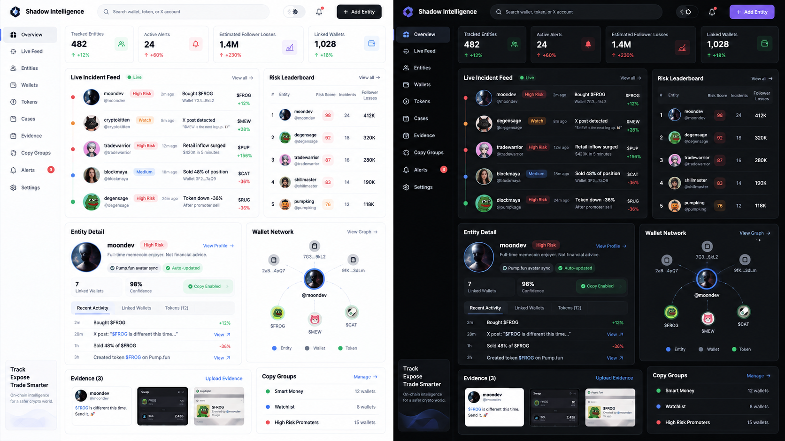

# Shadow Intelligence — Replit-ready MVP

A clean, dependency-light starter for an on-chain intelligence + reputation + multi-wallet copy-trading product. It is intentionally structured so the public product UI does **not** have to be rewritten when the existing trading engine and live providers are connected later.



## What is already implemented

- Light theme: white base, subtle gray surfaces, thin separators.
- Dark theme: black base, near-black surfaces, restrained borders.
- Responsive desktop/mobile single-page UI.
- Overview with live incident feed, risk leaderboard, entity snapshot, wallet graph, evidence, copy groups and compact community chat.
- Entity model: one public identity/X account → many wallets → tokens/incidents/evidence.
- Wallet avatar resolver with three paths: external profile adapter, manual avatar at entity/profile level, deterministic generated fallback.
- Email/password registration and sign-in using Node `scrypt` hashing and HttpOnly cookie sessions.
- User avatar upload, display name, X handle and short bio.
- One community chat room plus simple private direct messages.
- Owner/admin-only platform settings.
- Multi-wallet Copy Groups with `copy`, `watch`, and `inverse` modes.
- Copy-engine adapter: local simulation until `COPY_ENGINE_URL` is configured.
- Evidence uploads (small screenshots), source URLs and notes.
- SQLite persistence using Node 22's built-in `node:sqlite`, so there are no npm runtime dependencies.
- Demo intelligence data so the intended design is visible immediately.

## Replit install

1. Upload the entire folder or the ZIP to a new Replit Node.js project.
2. Open **Secrets** and optionally add the variables from `.env.example`.
3. Press **Run**. `.replit` runs `npm start` on port `3000`.
4. If `OWNER_EMAIL` and `OWNER_PASSWORD` are not configured, the **first registered account becomes owner**.

### Recommended owner Secrets

```text
OWNER_EMAIL=your@email.com
OWNER_PASSWORD=a-long-private-password
OWNER_NAME=Owner
NODE_ENV=production
```

Do not commit real passwords/API keys to GitHub.

## Connecting the existing copy-trading engine

This starter deliberately does not invent trading behavior. Configure:

```text
COPY_ENGINE_URL=https://your-existing-engine.example
COPY_ENGINE_TOKEN=...
```

When a Copy Group is enabled/paused, the server calls:

```text
POST {COPY_ENGINE_URL}/groups/sync
Authorization: Bearer {COPY_ENGINE_TOKEN}
Content-Type: application/json
```

Payload shape:

```json
{
  "group": {
    "id": "grp_...",
    "name": "Smart Money",
    "mode": "copy",
    "enabled": true
  },
  "wallets": [
    {
      "id": "wal_...",
      "address": "...",
      "chain": "solana"
    }
  ]
}
```

Replace `src/adapters/copy-trading.mjs` with the exact adapter for the existing MemeFlow engine once that repository is available.

## Pump.fun / profile avatar adapter

Set `PUMP_PROFILE_LOOKUP_URL` to a server-side profile resolver you trust. The app will call it with `?wallet=<address>` and accepts an image in one of these JSON fields:

```text
avatarUrl | avatar | image | profileImage
```

If the resolver is unavailable, a deterministic avatar is generated automatically. This keeps the UI complete without pretending a Pump.fun API exists where none has been configured.

## Live intelligence adapter

`INTELLIGENCE_PROVIDER_URL` is reserved for the live scanner/social intelligence service. The current database includes demo incidents only. The UI/data model already expects:

- entity + X identity
- linked wallets
- token
- event type (`buy`, `sell`, `social`, `inflow`, `drop`, etc.)
- severity/confidence
- timestamp
- evidence

## Safety / wording

The UI uses evidence-oriented labels such as **High Risk**, **Watch**, **observed pattern**, and **confidence**. It deliberately avoids automatically declaring a person a criminal or scammer. Risk scores are analytics, not legal determinations.

## Local development

```bash
npm start
# or
npm run dev
npm test
```

Requires Node 22.5+ because it uses the built-in SQLite module.

## Main files

```text
server.mjs                         HTTP server + APIs
src/db.mjs                        SQLite schema + demo seed
src/auth.mjs                      password hashing + sessions
src/adapters/copy-trading.mjs     external trading-engine boundary
src/adapters/pump-profile.mjs     wallet/profile avatar boundary
src/adapters/intelligence.mjs     live intelligence provider boundary
public/index.html                  app structure
public/styles.css                  light/dark responsive product UI
public/app.js                      SPA interactions, chat, DM, admin UI
```

## Next integration step

The current GitHub connector returned no accessible repositories in this session, so the exact production MemeFlow copy-trading source was not copied. Once GitHub access exposes that repository, wire its real execution methods into `src/adapters/copy-trading.mjs` and map its live intelligence events into the `incidents` table/API. No redesign is required for that integration.
